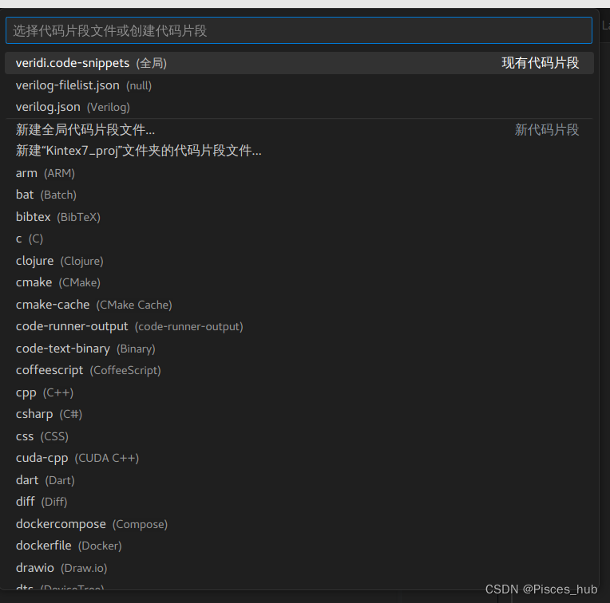

介绍如何使用Vscode来快速编辑verilog代码

背景：verilog中很多重复的结构和语句，针对此情况现有的插件代码补全太少了，所以出此文编写自定义代码块，拒绝重复编写同结构的代码，同结构代码自定义代码模板。
### 1.Vscode安装
- [Vscode官网](https://code.visualstudio.com/)
- [其他Vscode安装教程](https://zhuanlan.zhihu.com/p/44593798)
- [centos安装Vscode](https://blog.csdn.net/xyx0610/article/details/122805593)
------- 
### 2.IC代码插件推荐：

- Verilog
- Verilog Format
- Verilog HDL
- Verilog_Testbench
- Verilog-HDL/SystemVerilog/Bluespec SystemVerilog
- TCL Language Support
- Verilog Snippet
- Makefile Tools
- Error Lens（其他代码检查报错可以装这个！但还没有探索到检查verilog的）

尽量的都安装吧，反正没多大的坏处。


### 3.IC的module模板：
主要包含日常新建module、新建if、新建always、新建ifelse等语句的自动补全


然后选择所需要设置的代码类型：我用的是verilog.json（应该是某个插件的配置代码）

verilog.json文件内容：
```json
{
	// Place your snippets for verilog here. Each snippet is defined under a snippet name and has a prefix, body and 
	// description. The prefix is what is used to trigger the snippet and the body will be expanded and inserted. Possible variables are:
	// $1, $2 for tab stops, $0 for the final cursor position, and ${1:label}, ${2:another} for placeholders. Placeholders with the 
	// same ids are connected.
	// Example:

	// always
	"Print to always": {
		"prefix": "always",
		"body": [
			"always@(posedge sys_clk or negedge sys_rst_n) begin",
			"",
			"end",
		],
		"description": "always"
	},
	// if_rstn
	"Print to if_rstn": {
		"prefix": "if",
		"body": [
			"if(!sys_rst_n) begin",
			"",
			"end",
			"else begin",
			"",
			"end",
		],
		"description": "if_rstn"
	},
	// if_rstn_elseif_
	"Print to if_else": {
		"prefix": "if",
		"body": [
			"if(!sys_rst_n) begin",
			"",
			"end",
			"else if() begin",
			"",
			"end",
			"else begin",
			"",
			"end",
		],
		"description": "if_rstn"
	},
	// else
	"Print to else": {
		"prefix": "else",
		"body": [
			"else begin",
			"",
			"end",
		],
		"description": "if_rstn"
	},
	// repeat
	"Print to repeat": {
		"prefix": "repeat",
		"body": [
			"repeat (n) begin",
			"",
			"end",
		],
		"description": "repeat"
	},
	// module
	"Print to module": {
		"prefix": "module",
		"body": [
			"/*----------------------------------------------------------------",
			"****designer: ",
			"****email: ",
			"****date: ",
			"****funtions: ",
			"----------------------------------------------------------------*/",
			" ",
			"`timescale 1ns/1ps",
			"module A  #(",
			"    //parameter",
			"    parameter CLOCK_FREQ  = 50_000_000, //clock frequency",
			"    parameter DATA_WIDTH  = 8,          //width of data_width",
			")",
			"(",
			"    //sys signals",
			"    input      sys_clk      ,          //sys clock",
			"    input      sys_rst_n    ,          //sys rst",
			" ",
			"    //ctrl signals",
			"    input      _en          ,          //enable signals ",
			"    output     _done        ,          //finish signals ",
			" ",
			"    //data ",
			"    input      _data_in     ,          //data in",
			"    output     _data_out    ,          //data out",
			");",

			"    localparam  ;",
			" ",
			"    reg         ;",
			" ",
			"    wire        ;",
			" ",
			"    //funtion description",
			"    always@(posedge sys_clk or negedge sys_rst_n) begin",
			"        if(!sys_rst_n) begin",
			"            A <= 'd0 ;",
			"        end",
			"        else begin",
			"            A <= B ;",
			"        end",
			"    end",
			"    assign A <= B? 1'b1:1'b0;",
			" ",
			"    al",
			" ",
			"endmodule",

		],
		"description": "module"
	},
		// module
		"Print to module_tb": {
			"prefix": "module",
			"body": [
				"/*----------------------------------------------------------------",
				"****designer: ",
				"****email: ",
				"****date: ",
				"****funtions: ",
				"----------------------------------------------------------------*/",
				" ",
				"`timescale 1ns/1ps",
				"module A_tb ();",
				"    //parameter",
				"    parameter CLOCK_FREQ  = 50_000_000;  //clock frequency",
				"    parameter DATA_WIDTH  = 8;           //width of data_width",

				"    //sys signals",
				"    reg      sys_clk_reg      ;          //sys clock",
				"    reg      sys_rst_n_reg    ;          //sys rst",
				" ",
				"    //ctrl signals",
				"    reg      _en_reg          ;          //enable signals ",
				"    wire     _done        ;              //finish signals ",
				" ",
				"    //data ",
				"    reg      _data_in_reg     ;          //data in",
				"    wire     _data_out    ;              //data out",
				" ",
				" ",
				"    // reg => inst",
				"    wire sys_clk       = sys_clk_reg;",
				"    wire sys_rst_n     = sys_rst_n_reg;",
				" ",
				"    wire _en           = _en_reg;",
				"    wire _data_in_reg    = enspi_n_reg;",
				" ",
				"    localparam  CLOCK_TIME = 10;",
				" ",
				"    //generate clock and rst",
				"    always #(CLOCK_TIME) sys_clk_reg=~sys_clk_reg;",
				"    initial begin",
				"        sys_clk_reg   = 0;",
				"        sys_rst_n_reg = 0;",
				"        #(4*CLOCK_TIME)",
				"        sys_rst_n_reg = 1;",
				"    end",
				" ",
				"    //generate reg change,",
				"    always #(10*CLOCK_TIME) _en_reg ={$random} % 2;",
				"    initial begin",
				"        _data_in_reg = 'd0;",
				"        #(CLOCK_TIME)",
				"        repeat (20)  begin",
				"            _data_in_reg = 'd0;",
				"            #(CLOCK_TIME)",
				"            _data_in_reg = _data_in_reg + 1'b1; ",
				"        end",
				"    end",
				" ",
				"    // instantiate module",
				"    A *(",
				"        .CLOCK_FREQ(CLOCK_FREQ),",
				"        .DATA_WIDTH(DATA_WIDTH),",
				"    )",
				"    A_inst",
				"    (",
				"        .sys_clk     (sys_clk           ),",
				"        .sys_rst_n   (sys_rst_n_reg     ),",
				"        ._en         (en                ),",
				"        ._done       (done              ),",
				"        ._data_in_reg(_data_in_reg      ),",
				"        ._data_out   (_data_out         ),",
				"     );",
				" ",
				"endmodule",
	
			],
			"description": "module"
		}
}
```
注意：
1. 请尽量代码备注用英文，Poor English 都行，因为verilog这种代码还是采用vcs+verdi来仿真比较好，速度快，而且对任意信号都可以调用信号，vcs+verdi对中文不太友好。另外，对于module模块定义的时候，代码行后写该信号作用，并分接口类型前一行来写该组信号作用。**module模块信号尽可能地对齐。哪怕是标点符号，这样可以列选择，例化地时候非常方便！！！！**。
2. 另外对于经常写的代码，也可以通过这种方式来自动补全。
3. 在虚拟机中用VCS+Verdi的makefile文件请参考[VCS仿真教程(一)：Verilog+波形+Makefile](https://blog.csdn.net/burningCky/article/details/109891288)
4. 另外还希望每个模块尽可能地在开始写上笔名+联系方式+日期+功能描述（会借助插件生成时序图地尽量插上时序图方便回顾）。
### 4. Vscode生成时序图：
绘制波形插件，生成时序图
1. 教程：[Hitchhiker's Guide to the WaveDrom](https://wavedrom.com/tutorial.html)
2. 创建一个test.txt 文件
3. ctrl + shit + p 或F1 搜索toggle Live preview 可以打开和关闭实时预览。
4. 编辑完指令后，回车即可自动显示
6. 流程图Draw.io插件

[该文CSDN链接](https://mp.csdn.net/mp_blog/manage/article?spm=3001.5298)  