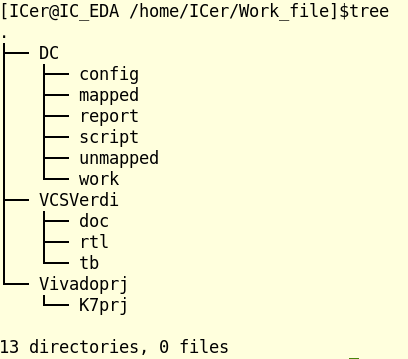
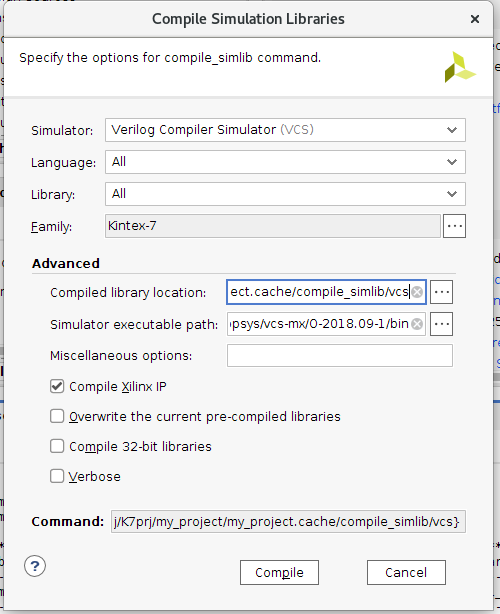
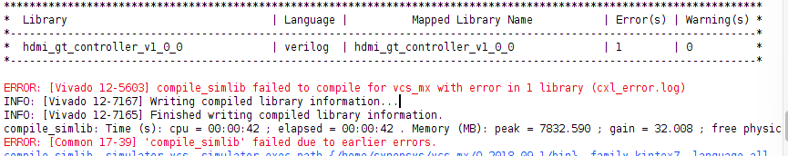
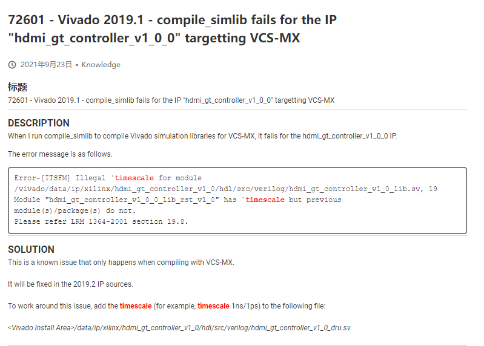

## 一、事前准备：
可以参考的资料：
[#vivado](https://mp.weixin.qq.com/mp/appmsgalbum?__biz=MzU3MTc1NDUzNg==&action=getalbum&album_id=2876409482669604867&scene=173&from_msgid=2247484182&from_itemidx=1&count=3&nolastread=1#wechat_redirect)
磨刀不误砍柴工！开始吧。
### 1.虚拟机
芯王国ALL版虚拟机链接：[IC\_EDA\_ALL虚拟机(丰富版)详细说明](https://mp.weixin.qq.com/s/1m4F4urrH8iU2VYosLEdEg)
why:提供了几乎全套的数字和模拟设计的软件工具！！
（不熟悉linux就不要在工具安装上花时间，当然用完有需要了再回看安装教程也可以）
[待加！](attachments/f5f16ddac75194f768ece83695adcb42_MD5.png)
虚拟机初次使用看这个：[微信公众平台](https://mp.weixin.qq.com/s/1m4F4urrH8iU2VYosLEdEg)

建立文件夹目录：
后续进一步添加
```
## 建立工作文件夹
cd /home/ICer
mkdir Work_file 

## 建立仿真、综合、Vivado工程文件夹
cd /home/ICer/Work_file
mkdir DC VCSVerdi Vivadoprj

## DC文件夹
cd /home/ICer/Work_file/DC 
mkdir config mapped report script unmapped work

## VCSVerdi文件夹
cd /home/ICer/Work_file/VCSVerdi
mkdir doc rtl tb work

## Vivadoprj文件夹
cd /home/ICer/Work_file/Vivadoprj
mkdir K7prj
```


### 2.Vivado
芯王国ALL版虚拟机里面集成了vivado2019.1，刚好不用加了。  
[vivado用命令创建工程、添加文件编译，综合、实现](https://mp.weixin.qq.com/s?__biz=MzU3MTc1NDUzNg==&mid=2247484031&idx=1&sn=0c18aa169c33422960482929c160c1ab&chksm=fcda1338cbad9a2eb03451a829010b19e06305a6ff563b941f598be77eb56a2233aec51ed100&scene=178&cur_album_id=2876409482669604867#rd)
- 参考该文章去掉vivado界面操作。
[[vivado批量处理汇总的源代码]]

### 3. Vscode编辑器
这是微软出的文本编辑器，有很多插件辅助！
- [介绍如何使用Vscode来快速编辑verilog代码](介绍如何使用Vscode来快速编辑verilog代码.md)
	- 该文档介绍了：
		1. Vscode安装
		2. Vscode的IC代码插件
		3. 添加自定义代码模板

### 4. Vivado与Vscode联动
参考资料：[Vivado加上VsCode让你的生活更美好\_vivado配置vscode\_南工小王子的博客-CSDN博客](https://blog.csdn.net/qq_39498701/article/details/84668833)
[ubuntu 下vivado关联vscode\_Taurus\_ZSZ的博客-CSDN博客](https://blog.csdn.net/qq_39597489/article/details/113445496)

### 5. VCS命令使用：
[Fetching Title#j0cc](https://blog.csdn.net/JasonFuyz/article/details/107508893)
vcs -R -full64 +v2k -fsdb +define+FSDB -sverilog counter.v tb_counter.v timescale.v -l run.log
其中-R表示自动运行仿真，+v2k表示使用Verilog-2001标准，-fsdb表示支持对fsdb相应操作，+define+FSDB相当于在verilog头文件里加上`define FSDB，-sverilog表示支持system verilog，输入.v文件的顺序可以不同（顺序是随意的）-l run.log表示将终端显示的信息在run.log中储存；
### 6. 芯王国vivado+vcs仿真 
- 参考资料:
	1. [使用VCS+Verdi对Xilinx IP仿真 - 知乎](https://zhuanlan.zhihu.com/p/38623543)
	2. [Vivado中调用vcs + dev或者VCS + verdi仿真方法详解\_vcs verdi makefile vivado\_Shawge的博客-CSDN博客](https://blog.csdn.net/Shawge/article/details/109170325)
	3. 参考博客：[Vivado 2019.02与VCS\_MX\_VO-2018.09-SP2的联合仿真\_vivado vcd文件\_缘来是你远去是我的博客-CSDN博客](https://blog.csdn.net/dogjunliang/article/details/112531568)
	4. [Vivado中调用vcs + dev或者VCS + verdi仿真方法详解\_vcs verdi makefile vivado\_Shawge的博客-CSDN博客](https://blog.csdn.net/Shawge/article/details/109170325)
为什么用VCS？  
我自己觉得vivado自身仿真速率慢，无法对信号追溯，每次都要重新添加。
而VCS就很快，并且对信号追溯方便。
设置VCS时的一个报错:



解决方法是在该文件头加入
```
`timescale 1ns/1ps
```

## 
注意：
我的技巧：新建一个fsdb.v文件来控制产生波形时间和波形文件:
```
`timescale 1ns/1ps
module fsdb();

initial begin
        #1000000;
        $finish;
end


`ifdef FSDB
initial begin
        $fsdbDumpfile("simv.fsdb");
        $fsdbDumpvars;

end
`endif
`ifdef VCD
initial begin
        $dumpfile("simv.vcd");
        $dumpvars;
end
`endif

endmodule
```

### 7. 下载CortexM0内核
[下载ARM Cortex M0核的RTL源码\_m0内核源码\_mkelehk的博客-CSDN博客](https://blog.csdn.net/litao31415/article/details/81369486)
