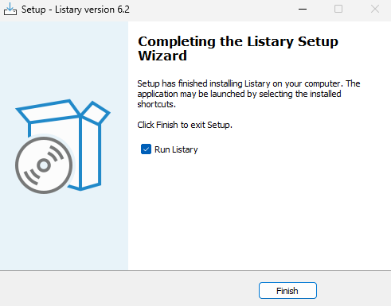
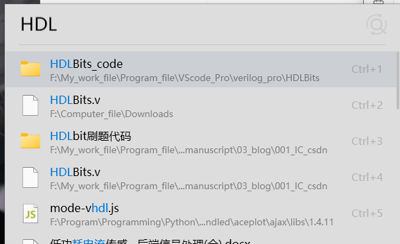
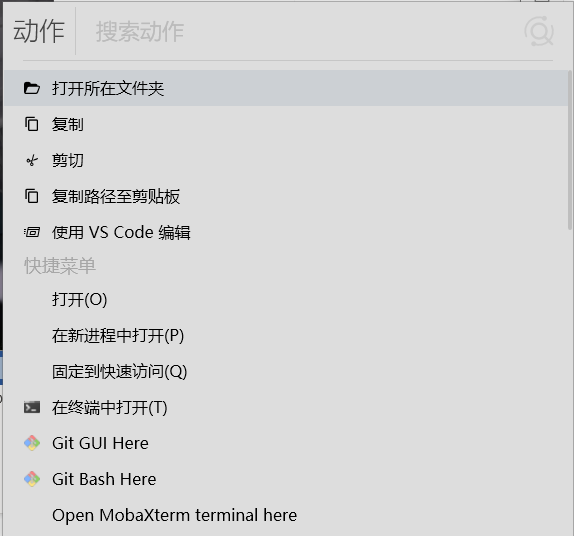

# Listary介绍

电脑文件一旦多了，windows自带的查找就非常慢

这里介绍Listary软件可以快速的查找电脑中的文件

### 1、下载安装

请移步官网下载[listary]((https://www.listary.com/))，大小~=6M。

安装至：D://Program//Tool_Software//listary中。

然后直接运行即可，软件默认开机自动启动。

## 2、使用：

双击Ctrl便可搜索。

右键可以选择一些动作。

在一些文件夹下可以左键双击调用一些命令或跳转位置。

