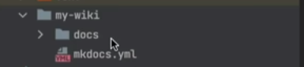
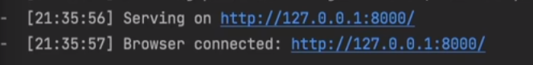
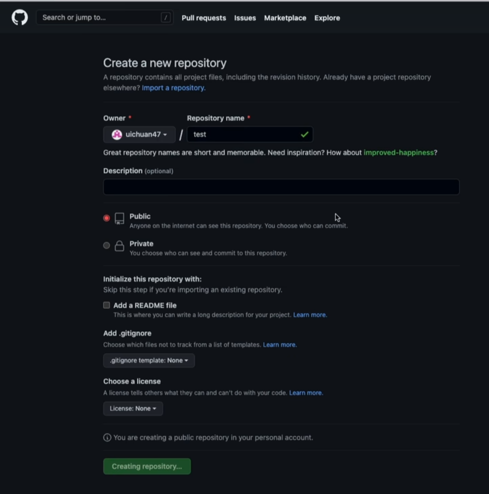
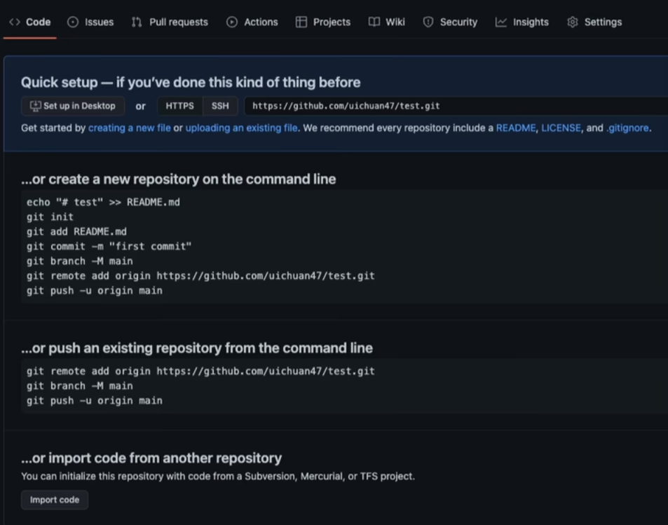

## 1. 关于环境
基于python3.9创建虚拟环境，python环境配置指令参考[python环境设置](../003_Python/python环境设置.md)  

如果安装有anaconda，则用<span style="background:rgba(173, 239, 239, 0.55)">anaconda创建环境</span>

```python
# 创建虚拟环境
conda create -n mkdocs_env python=3.9
# 激活虚拟环境：
conda activate mkdocs_env
# 检查pip list是不是空的
pip list
```

## 2. 关于mkdocs

用mkdocs在github上部署使用非常方便：可以将markdown全部转为HTML，可以部署到服务器或者github。

## 3. 安装mkdocs

```
pip install Mkdocs
```

安装 & 配置主题

```
pip install mkdocs-material
```

```
theme:
	name:material
```

--- 

文末我会附上我自己网页的**mkdocs.yml**文件

mkdocs.yml需要修改的地方：
```
site_name: # 网页名字
theme:
	favicon: assets/images/favicon.png # 网页的标签图
	logo: assets/images/logo.png   # 主页的个人log
	name:material # 想使用的主题
```

---

## 4. 创建项目

```
mkdocs new my_website
cd my_website
```

创建后文件夹是这样的：



预览项目：先进入my_website文件夹，再运行`mkdocs serve`

```
cd my_website
mkdocs serve
```
本地链接  


## 5. 页面布局

[导航栏支持多级布局：](https://mkdocs-like-code.readthedocs.io/zh_CN/latest/MkDocs-advanced-operations/theme-configuration/)


## 6. github上传：


创建新的仓库 


将本地推送到仓库：



git以及上传github命令：
```
git init
git add README.md
git commit -m "first commit"
git branch -M main
git remote add origin yourgithub.git
git push -u origin main
```

## 7. 部署到github

- 完成github仓库创建
- 本地做完后git之后push到github远程仓库
```
git push origin main
```
- 进入my_website文件夹，进行部署：
```
mkdocs gh-deploy
```
部署后需要等待>30s左右才会完成渲染，稍安勿躁。
```
https://yourhub.github.io/yourrepositories/
```
## 8. 后续上传：

在相应的文件夹下：

```
git add .
git commit -m "update"
git push -u origin main
mkdocs gh-deploy
```

非常感谢[8047-](https://www.bilibili.com/video/BV1FB4y1n7Gf/?spm_id_from=333.880.my_history.page.click&vd_source=f6b887c95aa7969fce3d0ed6ca6f2232)up主的视频帮助，让我快速掌握个人网站搭建。也非常感谢[MkDocs](https://www.mkdocs.org/) 作者的贡献.以及感谢[github pages](https://pages.github.com/)平台

这里是我的个人网站[Pisceshub](https://Pisceshub.github.io/My_website/)


附件：**mkdocs.yml**文件内容：

```
site_name: Pisceshub
theme:
  favicon: assets/images/favicon.png
  logo: assets/images/logo.png
  name: material
  language: en
  features:
    - navigation.path
    - navigation.instant
    - navigation.tracking
    - navigation.prune
    # - toc.integrate
    - navigation.top
    - search.share
    - header.autohide
    - announce.dismiss
    - navigation.footer

  palette:
    # Palette toggle for light mode
    - media: "(prefers-color-scheme: light)"
      scheme: default
      ## set colour
      # red， pink， purple， deep purple， indigo， blue， 
      # light blue，cyan，teal，green，light green，lime，
      # yellow，amber，orange，deep orange
      primary: black  
      accent: indigo
      toggle:
        icon: material/weather-sunny
        name: Switch to dark mode

    # Palette toggle for dark mode
    - media: "(prefers-color-scheme: dark)"
      scheme: slate
      primary: black
      accent: blue grey
      toggle:
        icon: material/weather-night
        name: Switch to light mode
  font:
    text: Roboto
    code: Roboto Mono
extra_css:
  - stylesheets/extra.css

# extra:
#   homepage: https://example.com


extra:
  version:
    provider: mike
  consent:
    title: Cookie consent
    description: >- 
      We use cookies to recognize your repeated visits and preferences, as well
      as to measure the effectiveness of our documentation and whether users
      find what they're searching for. With your consent, you're helping us to
      make our documentation better.


copyright: >
  Copyright &copy; 2016 - 2023 Martin Donath –
  <a href="#__consent">Change cookie settings</a>

extra_javascript:
  - javascripts/consent.js

plugins:
  - search
  - tags

```